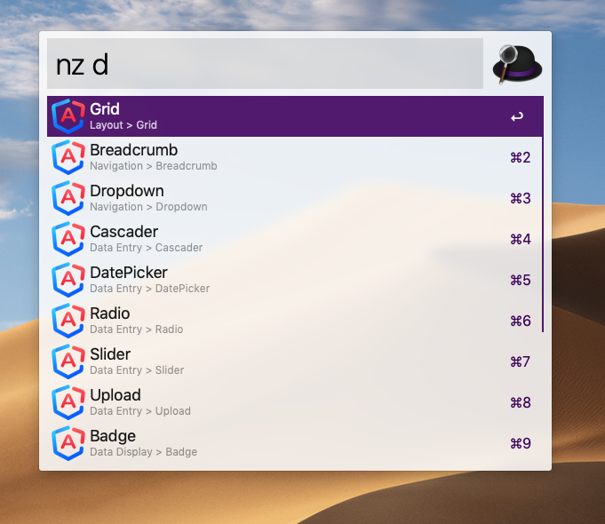

# alfred-ngzorro

Support for Alfred 3 + Alfred 4

> Ant Design of Angular documentation




## Install

```
$ npm install --global alfred-ngzorro
```

*Requires [Node.js](https://nodejs.org) 8+ and the Alfred [Powerpack](https://www.alfredapp.com/powerpack/).*


## Usage

In Alfred, type `nz`, <kbd>Enter</kbd>, and your query.


## License

MIT © [Klaas Cuvelier](http://klaascuvelier.io)
